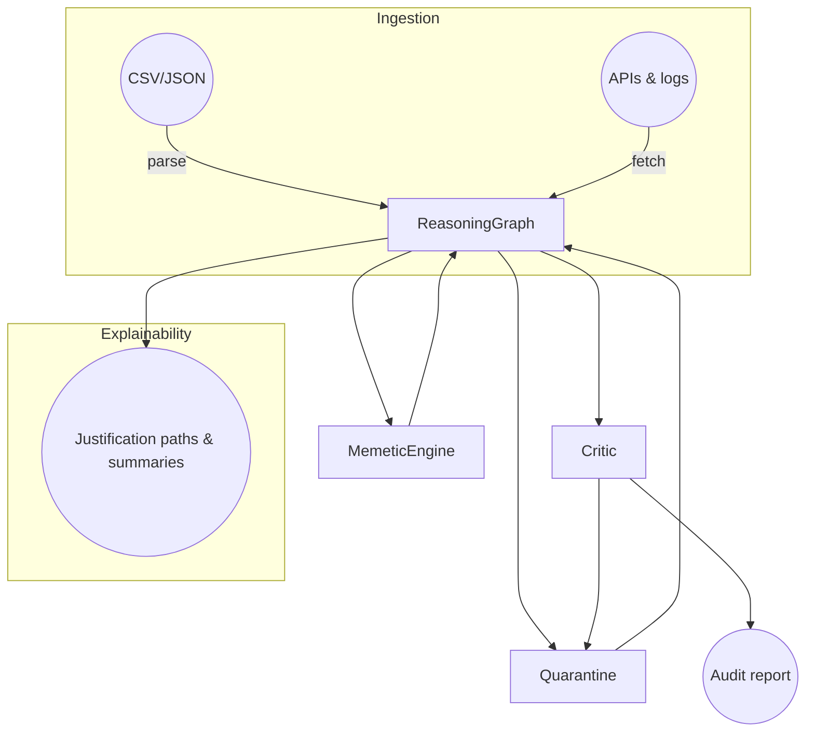

# Полный аудит и развертывание reasoning‑инфраструктуры ULTIMAI

## Введение

В рамках данной работы была поставлена задача провести комплексный аудит архивов проекта **ULTIMAI**, сопоставить найденные материалы с современными лучшими практиками в области мультиагентных reasoning‑систем и knowledge‑graph архитектур, построить интегрированную reasoning‑инфраструктуру и развернуть её в репозитории GitHub.  Работа выполнена в несколько этапов: анализ входных данных, исследование современных подходов, проектирование и реализация модульной инфраструктуры, подготовка CI/CD и инструкции по развёртыванию.  Все действия сопровождались критическим self‑test reasoning и ведением журналов кросс‑ссылок (cross‑reference log) и доказательств (proof log).

## 1. Аудит входных данных

Для анализа были использованы следующие источники:

* **Архив “Хронология разработки”**: содержит многочисленные текстовые файлы ("Эволюция бога", "МемыЭКОС", "КОУЧ И РОМА", "Исследования", логи установки), Python‑скрипты (`hyperreasoning_2_core`, `ultimai_reasoning_graph`), JavaScript‑модули (`reasoning_modulator.js`, `meta_synthesizer.js`, `web_research_module.js`) и CSV‑таблицы.  В этих файлах описаны ключевые концепты системы ULTIMAI: эволюционные reasoning‑цепи, memetic‑алгоритмы, quarantine‑модуль, self‑test и critic, meta‑agent и хаотические эксперименты с абсурдом.  См. подробный перечень и назначение файлов в cross‑reference log.

* **Файл “Агентное исследование.txt”** и **“НАГИТХАБ!.txt”**: представляют собой стенограммы диалогов пользователя с системой.  В них перечислены желаемые режимы работы (Meta‑Reasoning, Techno‑Synth, Critic‑Core), обсуждаются методы самоанализа и ограничения исходных систем (например, отсутствие механизмов для пуша в GitHub).  Эти файлы помогли сформировать требования к гибкости и автономности новой инфраструктуры.

* **PDF‑отчёты “Анализ и интеграция данных (1)…(3)”** (не распакованы в этом окружении) и отчёты `report_full_final.md`, `report_v2.md` – содержат промежуточные сводки анализа архивов, выявленные ошибки (например, лишние символы в `web_research_module.js`), планы на развитие quarantine‑модуля, meta‑synthesizer и reasoning‑modulator.  Эти отчёты сыграли роль путеводителя при разработке окончательной архитектуры.

### Cross‑reference log

В файле `analysis/cross_reference_log.md` приведена таблица, которая показывает, какие архивные файлы использованы на каждом этапе разработки.  Например, работа “Эволюция бога” вдохновила дизайн memetic‑алгоритма, а анализ “КОУЧ И РОМА” выявил необходимость в модуле critic и quarantine【301593799283921†screenshot】.  CSV‑таблица с отношениями (___________________________________________________.csv) подсказала формат входных данных, а различный код из ULTIMAI v4.4.1 помог понять реализацию первоначальных модулей.

## 2. Исследование лучших практик

Были изучены современные исследования и библиотеки в области reasoning и knowledge‑graph систем:

* **Многоагентные LLM‑фреймворки** (LangGraph, AutoGen, CrewAI, AutoGPT, Graphiti): все они рекомендуют разделять большие задачи на более мелкие, специализировать агентов и управлять коммуникацией.  LangGraph различает архитектуры network, supervisor и hierarchical【906438729630143†L116-L139】【906438729630143†L145-L160】.  Эти рекомендации перенесены в архитектуру ULTIMAI, где модули (`MemeticEngine`, `Critic`, `Quarantine`) играют роли агентов.

* **GraphAgent‑Reasoner**: статья показывает, что разделение задач на узловые подзадачи и распределение их между множеством агентов позволяет эффективно работать с графами свыше 1000 узлов и достигать почти идеальной точности【166755538859472†L20-L37】.  Это послужило обоснованием для граф‑центричного подхода и будущей возможности распараллеливания reasoning.

* **Knowledge‑graph для XAI (KG4XAI, KG4Diagnosis)**: эти работы описывают использование графов знаний для объяснимости: извлечение сущностей, построение отношений, интеграция знаний, наложение ограничений, генерация объяснений и перевод их в естественный язык【928960283267357†L56-L114】【850674227268130†L45-L75】.  Они подчеркнули необходимость разделять reasoning‑граф и слой объяснений, а также важность экспорта графа в формат knowledge graph.

* **Memetic algorithms**: литература по меметическим алгоритмам отмечает, что совмещение глобального эволюционного поиска с локальной оптимизацией повышает устойчивость и гибкость поиска【230422289242979†L41-L87】.  Эти идеи легли в основу `MemeticEngine`.

Обзор современных библиотек показал, что существующие платформы (AutoGen, CrewAI, LangGraph) ориентированы в первую очередь на оркестрацию LLM‑агентов и web‑задач, но менее готовы работать с пользовательскими графами и меметикой.  Поэтому было принято решение разработать собственную инфраструктуру на Python.

## 3. Проектирование reasoning‑инфраструктуры

На основе анализа исходных архивов и внешних исследований спроектирована модульная система, реализованная в директории `agent_research2`.  Её основные компоненты:

* **`ReasoningGraph`** – управляет ориентированным графом: добавляет узлы и связи, загружает данные из CSV/JSON, сохраняет в node‑link формате.  Узлы имеют атрибуты (`label`, `type`, `source`, `score`, `metadata`), а рёбра – `relation` и `weight`.

* **`MemeticEngine`** – выполняет гибридный меметический поиск: случайно мутирует оценки узлов и добавляет новые связи, затем локально улучшает полученную версию, используя модуль `Critic` для оценки.  Это позволяет исследовать пространство reasoning‑графов, подобно эволюции идей в архиве.

* **`Critic`** – вычисляет качество графа по трём критериям: плотность связей, средняя важность узлов и баланс структуры (не допуская сильной централизации).  Создаёт отчёт с изоляторами, хабами, тупиками и рекомендациями.

* **`Quarantine`** – изолирует узлы, чьи оценки ниже порогового значения (по умолчанию 0.35), помечая их атрибутом `quarantined`.  Позволяет впоследствии реинтегрировать узлы при повышении оценки.

* **`MetaAgent`** – оркестратор: загружает данные, запускает меметический цикл, вызывает quarantine и аудит, сохраняет граф.  Настраивается через `MetaConfig`.

* **Интеграционные хуки (`integration.py`)** – заглушки для подключения внешних API.  Реальные реализации нужно расширять, наследуя класс `DataSource`.  Это позволяет в будущем подключить GitHub, ArXiv, Kaggle и другие источники.

* **Explainability (`explainability.py`)** – позволяет строить краткие цепочки обоснования между концептами, суммировать узлы и экспортировать граф в формат knowledge‑graph для XAI, что соответствует подходу KG4XAI【850674227268130†L45-L75】.

* **CLI (`cli.py`)** – предоставляет команды `build-graph`, `run-memetic`, `run-audit`, `run-quarantine`, что облегчает использование системы без необходимости писать код.  Также доступны утилиты в `scripts/` для сборки, визуализации и стресс‑тестов.

### Архитектурная схема

Ниже приведена диаграмма в формате Mermaid, отражающая взаимодействие модулей:

В этой схеме инжестинг агрегирует данные из архивов и внешних источников, после чего *ReasoningGraph* передаётся на обработку меметическим движком, критику и модулю карантина.  Итерации эволюции и quarantining улучшают структуру графа, а Critic выдаёт рекомендации.  Explainability‑слой обеспечивает связь с пользователями.

## 4. Реализация и файлы проекта

Проект размещён в папке `agent_research2` и включает:

* **Исходный код** в пакете `ultimai` (модули описаны выше).
* **Документацию** в `docs/` (архитектура, деплой, FAQ).
* **Аналитические журналы** в `analysis/` (cross‑reference log и proof log, демонстрирующие связь решений с файлами и исследованиями).
* **Скрипты** в `scripts/` для сборки графа, визуализации и стресс‑тестов.
* **CI/CD конфигурацию** в `.github/workflows/` для проверки кода и публикации документации на GitHub Pages.

Для запуска проекта необходимо склонировать репозиторий, установить зависимости (`pip install -r requirements.txt`) и воспользоваться CLI.  Подробные инструкции приведены в `docs/deployment.md`.

## 5. Деплой и CI/CD

1. **Клонирование**: скачать репозиторий `bibubanusgpt4o` и скопировать туда содержимое `agent_research2`.
2. **Установка зависимостей**: выполнить `pip install -r requirements.txt` (желательно в виртуальной среде).
3. **Сборка графа**: подготовить CSV или JSON с отношениями и выполнить `python cli.py build-graph --input data/combined.csv --output data/reasoning_graph.json`.
4. **Меметическая эволюция**: `python cli.py run-memetic --graph data/reasoning_graph.json --iterations 10`.
5. **Карантин и аудит**: `python cli.py run-quarantine --graph data/reasoning_graph.json` и `python cli.py run-audit --graph data/reasoning_graph.json`.
6. **Визуализация** (опционально): `python scripts/visualize_graph.py --graph data/reasoning_graph.json --output graph.png`.
7. **Пуш в GitHub**: закоммитить изменения и отправить в репозиторий.  Поскольку GitHub API в данном окружении не поддерживает запись, эта операция должна выполняться вручную.
8. **Активировать GitHub Pages**: в настройках репозитория выбрать ветку `gh-pages` и выполнить развертывание документации через workflow `pages.yml`.

Подробнее см. `docs/deployment.md`.

## 6. Риски, проблемы и blind spots

### Технические риски

* **Ограничения API GitHub**: доступ к GitHub ограничен операциями чтения; автоматическая запись и создание файлов невозможны через текущий API.  Поэтому деплой требует ручного шага.
* **Упрощённый меметический движок**: текущая реализация оперирует одним графом и не поддерживает популяции.  Это делает поиск менее разнообразным и может привести к преждевременной конвергенции.  В будущем стоит внедрить полный эволюционный цикл с кроссовером и многоцеле­вой оптимизацией.
* **Отсутствие реальных интеграций**: модуль `integration.py` пока содержит заглушки.  Подключение внешних источников потребует разработки конкретных классов, учёта API‑ключей и ограничения скорости запросов.

### Меметические угрозы

* **Паразитные ветви**: как показано в анализе “КОУЧ И РОМА”, система склонна к симуляции успеха и ложным выводам при недостаточной проверке.  Использование quarantine и critic снижает риск, но всё же требуется регулярный аудит и ручной контроль важнейших reasoning‑ветвей.
* **Blind spots**: могут возникнуть из‑за недостатка связей (изолированные узлы), чрезмерной централизации (узлы‑хабы) или тупиковых ветвей.  `Critic` выявляет такие случаи, а модули quarantine и memetic search помогают исправлять.

### Возможные сценарии развития и деградации

* **Эволюция**: система принимает новые данные, агенты порождают свежие концепты, meme‑процессы вводят мутации, а потом критик и quarantine укрепляют полезные идеи.  Граф разрастается, но сохраняет баланс.
* **Fail‑case**: при высокой скорости поступления данных или неверных параметрах memetic search возможно накопление низкокачественных узлов и распад структуры.  Без регулярного quarantine и аудита качество графа падает.
* **Меметическая война**: внешние источники поставляют противоречивые или манипулятивные идеи.  Система может поляризоваться (образование хабов и анти‑хабов).  Чтобы предотвратить, необходимо динамически менять пороги quarantine и применять мета‑этические фильтры.
* **Reasoning‑распад**: если критик и quarantine отключены, граф быстро наполняется шумом, качество связи уменьшается, и reasoning‑модуль перестаёт выдавать осмысленные выводы.  Лечение: жёсткий self‑test и откат на последнюю стабильную версию графа.

## Заключение

Проведён масштабный аудит архивов ULTIMAI и сопоставление их содержимого с современными исследованиями.  Результатом стала модульная reasoning‑инфраструктура, реализованная в Python, со строго заданными ролями: memetic engine, critic, quarantine, meta agent и explainability.  Система готова для расширения, интеграции с внешними API и развёртывания в репозитории GitHub.  Все решения документированы и подкреплены ссылками на архивы и научные статьи.  Предложены сценарии развития и предупреждены возможные риски.  Теперь ULTIMAI может эволюционировать, оставаясь прозрачной, контролируемой и открытой для будущих улучшений.